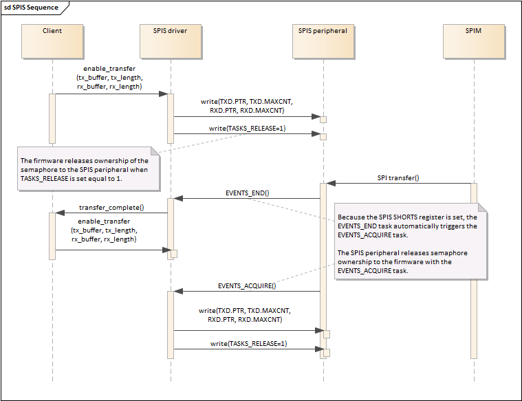

Nordic SPIS driver
==================

Reference Nordic nRF52832 Product Specification v1.4, 32.3 SPI slave operation

The SPIS peripheral contains a semaphore which allows it to interact with
the firmware.

When the SPIS register ENABLE is set, enabling the SPIS peripheral,
the SPIS grants ownership of the semaphore to the firmware.

The firmware can write the SPIS registers RXD, TXD when it owns the semaphore.

The firmware must release the semaphore back to the SPIS peripheral before the
SPI master attached to the SPIS peripheral begins the transaction. This is done
by the firmware writing a one '1' to the SPIS register TASKS_RELEASE.
The SPI transaction begins when the SPI master asserts the Slave Select (SS)
line low.

If the SPIS peripheral does not have ownership of the sempaphore before the
SPI transaction starts the incoming MOSI data will ge discarded and the SPIS
register DEF value will be captured to the RXD buffer.

When the transaction is complete the SPIS peripheral will send the firmware the
EVENTS_END via the SPIS interrupt. The transaction is complete when the SS pin
is deasserted high by the SPI master.

If the SPIS SHORTS register is set to enable the SPIS_SHORTS_END_ACQUIRE bit
then the event EVENTS_ACQUIRED is sent to the firmware at the end of the SPI
transaction. The firmware accepts semaphore ownership by clearing the
SPIS register EVENTS_ACQUIRED.

A Sequence Diagram helps illustrate the SPIS transaction.

